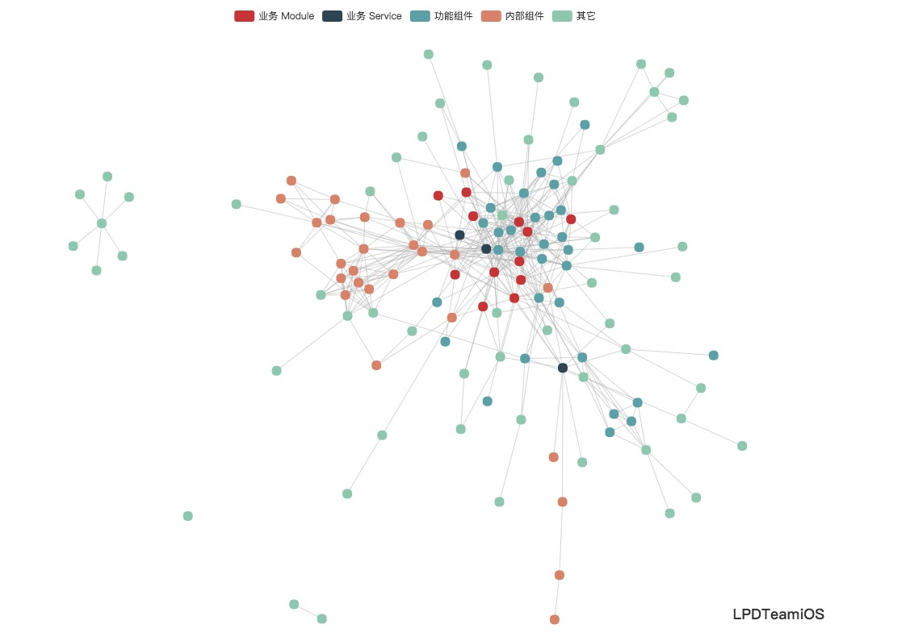
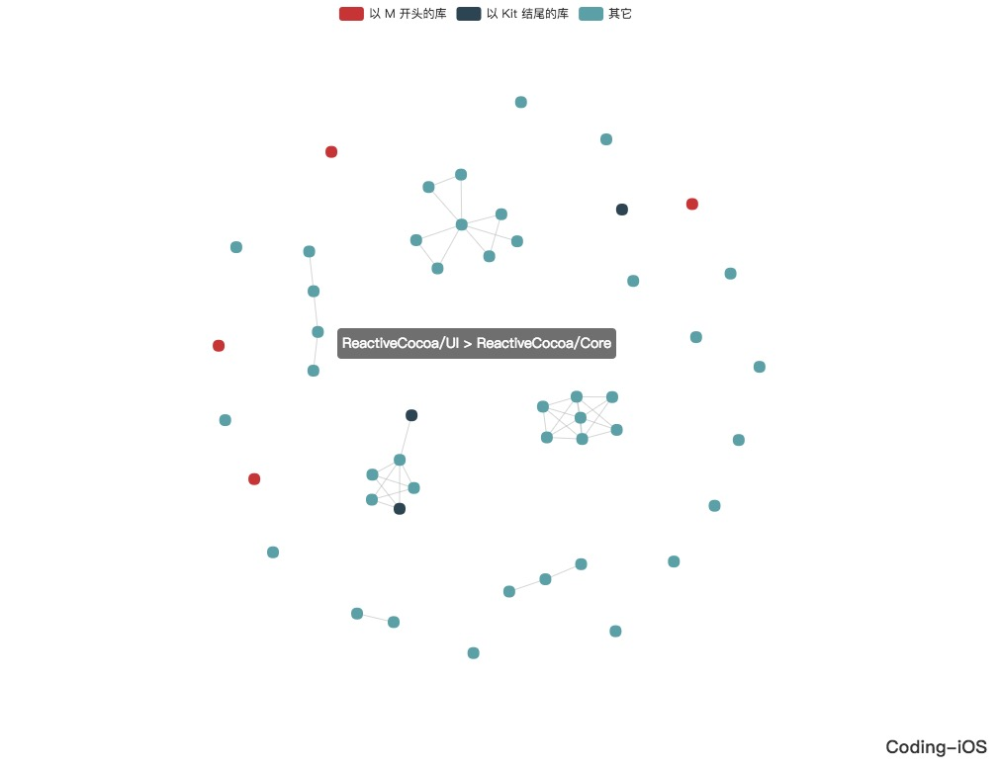
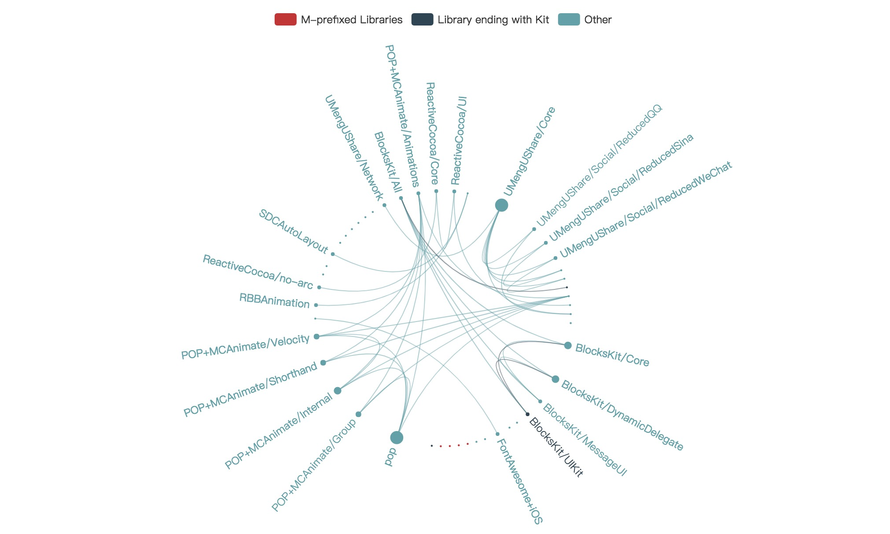

<p align="center">
    <a href="https://pypi.org/project/efpodsanalyzer/">
        
    </a>
    <a href="https://www.python.org/">
        
    </a>
    <a href="https://codebeat.co/projects/github-com-eyrefree-efpodsanalyzer-master">
        
    </a>
    <a href="https://raw.githubusercontent.com/EyreFree/EFPodsAnalyzer/master/LICENSE">
        
    </a>
    <a href="https://twitter.com/EyreFree777">
        
    </a>
    <a href="http://weibo.com/eyrefree777">
        
    </a>
    <a href="https://raw.githubusercontent.com/EyreFree/EFQRCode/assets/icon/MadeWith%3C3.png">
        
    </a>
</p>

EFPodsAnalyzer 是一个用来帮助我们梳理项目 CoaoaPods 库依赖关系的 Python 脚本，一个命令即可生成清晰的 Pods 依赖关系图，给我们的依赖整理 / 组件清理工作带来一定的帮助（广告：EF 的组件化 / 模块化总结 [蜂鸟商家版 iOS 组件化 / 模块化实践总结](https://juejin.im/post/5a620cf5f265da3e36415764) 望能够给大家提供一些参考）。

> [English Introduction](/README.md)

## 预览

Pods 库越多、依赖关系越复杂的库，越是用得到本工具，例如模块化后的项目；反之如果项目依赖很少，依赖关系非常简单的话，其实基本不需要本工具（当然你硬是要用我也不拦着）。我司某项目的依赖关系图大致如下，一坨：



## 环境

- Python 2.7

## 安装

### PyPI

如果你的设备上已经安装了 pip 的话，可以使用如下命令直接安装本工具的最新版：

```
sudo pip install efpodsanalyzer --upgrade
```

### 手动

下载本仓库，或执行如下命令将本仓库 Clone 到本地：

```
git clone git@github.com:EyreFree/EFPodsAnalyzer.git
```

## 使用

### PyPI

1. 首先确保你的工程已进行 `pod install` 操作并成功生成了 Pods 目录；
2. 利用 pip 完成本工具 efpodsanalyzer 的安装；
3. 根据待分析项目的具体情况对依赖的库进行分类，并分别给出每个分类的正则对依赖的名称进行归类，然后将分类规则写到你的 Podfile 所在目录下的 `EFPAConfig.json` 文件中（EFPAConfig.json 结构参考下面的示例）；
4. 执行如下命令进行依赖关系图的生成：

```
sudo efpodsanalyzer [待分析项目的 Podfile 文件路径]
```

5. 查看终端的输出，若有看到如下日志表示生成完成，可用浏览器打开生成的关系图文件 `index.html`，即可进行浏览：

```
Dependency graph generated: .../EFPADiagram/index.html
```

若抛错的话请根据对应的错误信息进行处理，有其他问题欢迎 PR 或 Issue。

### 手动

1. 首先确保你的工程已进行 `pod install` 操作并成功生成了 Pods 目录；
2. 本仓库内容已完整下载到本地；
3. 根据待分析项目的具体情况对依赖的库进行分类，并分别给出每个分类的正则对依赖的名称进行归类，然后将分类规则写到你的 Podfile 所在目录下的 `EFPAConfig.json` 文件中（EFPAConfig.json 结构参考下面的示例）；
4. 执行如下命令进行依赖关系图的生成：

```
python [EFPodsAnalyzer.py 文件路径] [待分析项目的 Podfile 文件路径]
```

5. 查看终端的输出，若有看到如下日志表示生成完成，可用浏览器打开生成的关系图文件 `index.html`，即可进行浏览：

```
Dependency graph generated: .../EFPADiagram/index.html
```

若抛错的话请根据对应的错误信息进行处理，有其他问题欢迎 PR 或 Issue。

## 示例

这里我们以 [Coding 的开源 iOS 客户端](https://github.com/Coding/Coding-iOS) 为例，给大家演示一下完整的使用过程：

1. 利用 pip 完成本工具 efpodsanalyzer 的安装；
2. 然后下载 Coding iOS 端工程到本地，并进行 `pod install` 操作；
3. 因为这里 Coding 客户端的依赖基本没啥可归类的，都是第三方库；所以出于演示目的，这里我分为了「以 M 开头的库」、「以 Kit 结尾的库」和「其它」三类，对应的 `EFPAConfig.json` 如下（你也可以 [点击此处](https://github.com/EyreFree/EFPodsAnalyzer/blob/master/efpodsanalyzer/EFPAConfig.json) 在线查看配置文件示例）：

```
{
    "config": {
        "categories": ["以 M 开头的库", "以 Kit 结尾的库", "其它"],
        "categoryRegexes": ["^M.*", ".*(Kit)$", ".*"]
    }
}
```

4. 关系图生成的命令如下：

```
sudo efpodsanalyzer /Users/eyrefree/Documents/iOS_GitHub/Coding-iOS/Podfile
```

5. 最后生成的依赖关系图如下，你可以进行 [在线预览](https://eyrefree.github.io/EFPodsAnalyzer/graph_force.html)：



- 点击上方的类目名可控制该类的显示和隐藏；
- 鼠标悬浮于节点上可显示节点名；
- 鼠标悬浮于两点之间的连线上可显示两节点之间的依赖关系。

另一种样式 `circular`，如下图所示，同样可以 [在线预览](https://eyrefree.github.io/EFPodsAnalyzer/graph_circular.html)：



## 计划

- 根据头文件引用进一步判断依赖是否需要移除；
- 根据类依赖关系进一步判断依赖是否需要移除；
- 支持更多关系图样式。

## 其它

1. 依赖图的展示使用了 [ECharts](https://github.com/ecomfe/echarts) 图表库和 [xml2json](https://github.com/abdmob/x2js) 解析库，在此对这些项目的开发人员表示感谢！
2. 本仓库代码可使用如下命令打包 / 发布，有二次开发需求的同学可自行摸索（请在本仓库根目录下执行）：

```
rm -rf dist/*;
python setup.py sdist bdist_wheel;
twine upload dist/efpodsanalyzer*;
```

## 作者

EyreFree, eyrefree@eyrefree.org

## 协议


EFPodsAnalyzer 基于 GPLv3 协议进行分发和使用，更多信息参见协议文件。
